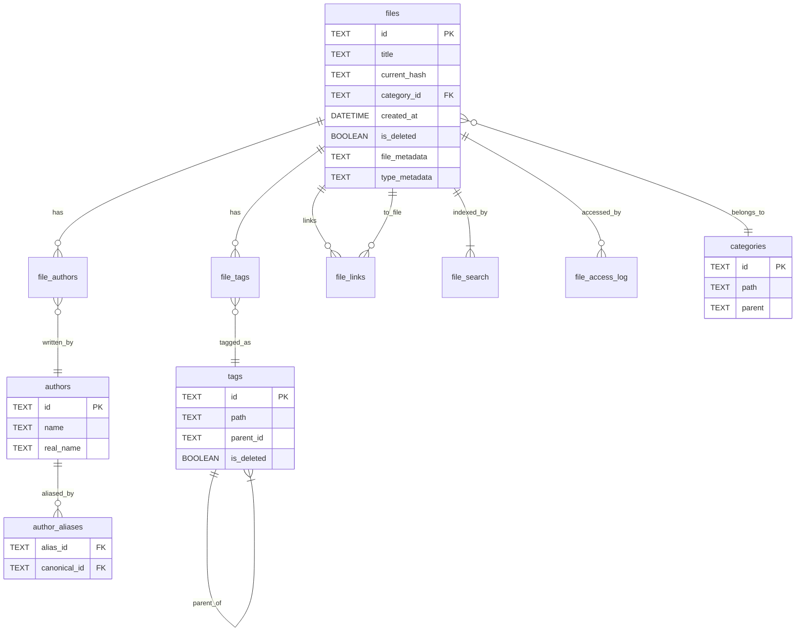
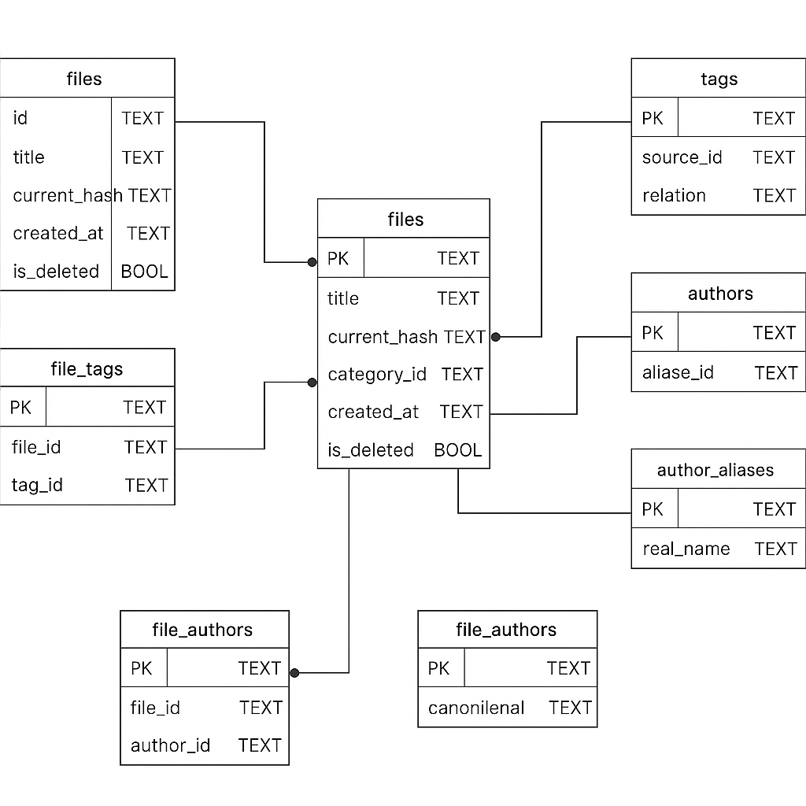

# TagBox 数据库设计文档





## 一、设计目标

TagBox 的数据库旨在实现以下核心能力：

* 高效管理本地文件的结构化元信息（如标题、作者、标签、分类）
* 支持多对多的标签、作者关系，支持作者笔名归一
* 支持全文模糊搜索（含中文）
* 支持文件之间的语义双链与来源管理
* 支持软删除机制、访问记录与热门文件统计

## 二、范式合规性分析

| 范式  | 要求                | 是否满足 | 说明                                              |
| --- | ----------------- | ---- | ----------------------------------------------- |
| 1NF | 所有字段为原子值，不能嵌套重复数据 | ✅    | 所有结构化字段（如 tags、authors）均已拆为独立关系表                |
| 2NF | 所有非主属性必须完全依赖主键    | ✅    | 主键采用 UUID，所有字段直接依赖 UUID 主键，无部分依赖                |
| 3NF | 消除传递依赖，字段依赖只指向主键  | ✅    | tags、categories、authors、links 等均拆分为独立逻辑实体，无冗余字段 |

数据库已在保持轻量的基础上，基本满足 1NF\~3NF 规范，确保结构清晰、扩展性强。

## 三、核心实体与关系结构（优化版）

### 1. files 文件主表

| 字段名            | 类型       | 说明                   |
| -------------- | -------- | -------------------- |
| id             | TEXT     | UUID，主键              |
| initial\_hash  | TEXT     | 首次导入时的 hash          |
| current\_hash  | TEXT     | 当前 hash，用于识别是否变更     |
| relative\_path | TEXT     | 相对路径                 |
| filename       | TEXT     | 实际文件名                |
| title          | TEXT     | 标题                   |
| year           | INTEGER  | 出版年份                 |
| publisher      | TEXT     | 出版社                  |
| category\_id   | TEXT     | 所属分类，外键指向 categories |
| source\_url    | TEXT     | 来源链接                 |
| summary        | TEXT     | 文件摘要                 |
| created\_at    | DATETIME | 创建时间                 |
| updated\_at    | DATETIME | 更新时间                 |
| is\_deleted    | BOOLEAN  | 是否逻辑删除               |
| deleted\_at    | DATETIME | 删除标记时间（可选）           |
| file\_metadata | TEXT     | 文件特定元数据（JSON 格式）      |
| type\_metadata | TEXT     | 内容类型元数据（JSON 格式）      |

### 2. tags 标签表

| 字段名         | 类型       | 说明              |
| ----------- | -------- | --------------- |
| id          | TEXT     | UUID 主键         |
| name        | TEXT     | 标签显示名           |
| path        | TEXT     | 层级路径（如 技术/Rust） |
| parent\_id  | TEXT     | 父标签 ID（可为空）     |
| created\_at | DATETIME | 创建时间            |
| is\_deleted | BOOLEAN  | 是否被禁用/隐藏        |

### 3. file\_tags 多对多标签关系表

| 字段名         | 类型       | 说明          |
| ----------- | -------- | ----------- |
| file\_id    | TEXT     | 外键，指向 files |
| tag\_id     | TEXT     | 外键，指向 tags  |
| created\_at | DATETIME | 关联时间        |

### 4. categories 分类表

| 字段名         | 类型       | 说明            |
| ----------- | -------- | ------------- |
| id          | TEXT     | UUID 主键       |
| path        | TEXT     | 分类路径（如 书籍/编程） |
| parent      | TEXT     | 父分类 ID（可空）    |
| updated\_at | DATETIME | 更新时间          |

### 5. authors 作者表

| 字段名         | 类型       | 说明               |
| ----------- | -------- | ---------------- |
| id          | TEXT     | UUID 主键          |
| name        | TEXT     | 显示名              |
| real\_name  | TEXT     | 本名（可空）           |
| aliases     | TEXT     | 笔名 JSON 数组（辅助信息） |
| bio         | TEXT     | 简介               |
| homepage    | TEXT     | 主页 / 个人网站 / 社交链接 |
| created\_at | DATETIME | 创建时间             |
| updated\_at | DATETIME | 更新时间             |
| is\_deleted | BOOLEAN  | 是否逻辑删除           |

### 6. file\_authors 多对多作者关系表

| 字段名        | 类型   | 说明            |
| ---------- | ---- | ------------- |
| file\_id   | TEXT | 外键，指向 files   |
| author\_id | TEXT | 外键，指向 authors |

### 7. author\_aliases 作者归一表

| 字段名           | 类型       | 说明                  |
| ------------- | -------- | ------------------- |
| alias\_id     | TEXT     | 笔名作者 ID（指向 authors） |
| canonical\_id | TEXT     | 主作者 ID（指向 authors）  |
| note          | TEXT     | 说明信息（如 人工归一）        |
| merged\_at    | DATETIME | 归一时间                |

### 8. file\_links 文件间关联表

| 字段名         | 类型       | 说明                           |
| ----------- | -------- | ---------------------------- |
| source\_id  | TEXT     | 外键，来源文件 ID（files）            |
| target\_id  | TEXT     | 外键，目标文件 ID（files）            |
| relation    | TEXT     | 关系类型，如 reference/translation |
| comment     | TEXT     | 备注                           |
| created\_at | DATETIME | 建立时间                         |

### 9. file\_search FTS5 虚拟表（全文索引）

```sql
CREATE VIRTUAL TABLE files_fts USING fts5(
  title, tags, summary, authors,
  content='files', content_rowid='rowid'
);
```

### 9. file\_metadata 元数据表

| 字段名        | 类型   | 说明                |
| ---------- | ---- | ----------------- |
| file\_id   | TEXT | 外键，指向 files     |
| key        | TEXT | 元数据键名           |
| value      | TEXT | 元数据值            |
| **主键**     |      | (file\_id, key)   |

> 注：在混合方案中，此表作为备选。优先使用 files 表中的 JSON 字段存储元数据。

## 四、扩展功能表（未来）

### 10. file\_access\_log 文件访问日志（可选）

| 字段名          | 类型       | 说明              |
| ------------ | -------- | --------------- |
| file\_id     | TEXT     | 被访问的文件 ID       |
| accessed\_at | DATETIME | 访问时间            |
| method       | TEXT     | CLI / GUI / API |

## 五、索引与完整性建议

### 常用索引

```sql
CREATE INDEX idx_files_category ON files(category_id);
CREATE INDEX idx_files_year ON files(year);
CREATE INDEX idx_files_hash ON files(current_hash);
CREATE INDEX idx_tags_path ON tags(path);
CREATE INDEX idx_authors_name ON authors(name);
-- JSON 索引（SQLite 3.38.0+）
CREATE INDEX idx_files_file_metadata ON files(file_metadata);
CREATE INDEX idx_files_type_metadata ON files(type_metadata);
```

### 外键约束策略

* files.category\_id → categories.id：`ON DELETE SET NULL`
* file\_authors → authors.id：`ON DELETE CASCADE`
* file\_tags → tags.id：`ON DELETE CASCADE`
* file\_links → files.id：`ON DELETE CASCADE`

## 六、元数据存储策略

### JSON 元数据字段说明

1. **file\_metadata** - 文件格式特定的技术元数据
   ```json
   {
     "pdf": {
       "pages": 450,
       "version": "1.7",
       "producer": "LaTeX",
       "has_ocr": true
     },
     "image": {
       "width": 1920,
       "height": 1080,
       "format": "PNG",
       "dpi": 300
     }
   }
   ```

2. **type\_metadata** - 内容类型特定的业务元数据
   ```json
   {
     "book": {
       "isbn": "978-xxx",
       "edition": "3rd",
       "series": "Head First",
       "language": "en"
     },
     "paper": {
       "doi": "10.1234/xxx",
       "journal": "Nature",
       "peer_reviewed": true,
       "citations": 42
     }
   }
   ```

### 查询示例

```sql
-- 查找所有 PDF 书籍
SELECT * FROM files 
WHERE file_metadata->>'$.pdf' IS NOT NULL 
  AND type_metadata->>'$.book' IS NOT NULL;

-- 查找特定 ISBN
SELECT * FROM files 
WHERE type_metadata->>'$.book.isbn' = '978-xxx';

-- 查找高分辨率图片
SELECT * FROM files 
WHERE CAST(file_metadata->>'$.image.width' AS INTEGER) > 1920;
```

## 七、实践建议

* 建议所有表使用 UTC 时间
* 所有主表建议添加 created\_at / updated\_at 字段
* FTS5 虚拟表同步更新需手动维护（建议通过触发器或逻辑同步）
* tag/category 支持逻辑删除字段 is\_deleted，避免误删
* 搜索推荐使用 tag 前缀匹配（`path MATCH '技术/*'`）
* JSON 字段建议创建合适的索引以提升查询性能
* 通用元数据（如作者、年份）直接作为列存储，特殊元数据使用 JSON

## 八、当前数据库架构（2025年1月）

### 实际表结构

#### 核心表

**files** - 文件主表
```sql
CREATE TABLE files (
    id TEXT PRIMARY KEY,
    title TEXT NOT NULL,
    initial_hash TEXT NOT NULL UNIQUE,
    current_hash TEXT,
    relative_path TEXT NOT NULL,
    filename TEXT NOT NULL,
    year INTEGER,
    publisher TEXT,
    category_id TEXT,
    source_url TEXT,
    summary TEXT,  -- 简单的摘要字段，非JSON
    created_at TEXT NOT NULL,
    updated_at TEXT NOT NULL,
    is_deleted INTEGER NOT NULL DEFAULT 0,
    deleted_at TEXT,
    file_metadata TEXT,  -- JSON格式文件特定元数据
    type_metadata TEXT,  -- JSON格式内容类型元数据
    UNIQUE(initial_hash)
);
```

**authors** - 作者表（扩展版）
```sql
CREATE TABLE authors (
    id TEXT PRIMARY KEY,
    name TEXT NOT NULL UNIQUE,
    real_name TEXT,
    aliases TEXT,  -- JSON数组
    bio TEXT,
    homepage TEXT,
    created_at TEXT NOT NULL,
    updated_at TEXT NOT NULL,
    is_deleted INTEGER NOT NULL DEFAULT 0
);
```

**tags** - 标签表（层级结构）
```sql
CREATE TABLE tags (
    id TEXT PRIMARY KEY,
    name TEXT NOT NULL,
    path TEXT NOT NULL UNIQUE,  -- 层级路径，如 "技术/Rust"
    parent_id TEXT,
    created_at TEXT NOT NULL,
    is_deleted INTEGER NOT NULL DEFAULT 0,
    FOREIGN KEY (parent_id) REFERENCES tags(id) ON DELETE SET NULL
);
```

#### 系统表

**system_config** - 系统配置
```sql
CREATE TABLE system_config (
    key TEXT PRIMARY KEY,
    value TEXT NOT NULL,
    description TEXT,
    created_at TEXT NOT NULL DEFAULT CURRENT_TIMESTAMP,
    updated_at TEXT NOT NULL DEFAULT CURRENT_TIMESTAMP
);
```

**file_history** - 文件操作历史
```sql
CREATE TABLE file_history (
    id TEXT PRIMARY KEY,
    file_id TEXT NOT NULL,
    operation TEXT NOT NULL,  -- create, update, move, delete, access
    old_hash TEXT,
    new_hash TEXT,
    old_path TEXT,
    new_path TEXT,
    old_size INTEGER,
    new_size INTEGER,
    changed_at TEXT NOT NULL DEFAULT CURRENT_TIMESTAMP,
    changed_by TEXT,
    reason TEXT,
    FOREIGN KEY (file_id) REFERENCES files(id) ON DELETE CASCADE
);
```

**file_access_stats** - 文件访问统计
```sql
CREATE TABLE file_access_stats (
    file_id TEXT PRIMARY KEY,
    access_count INTEGER NOT NULL DEFAULT 0,
    last_accessed_at TEXT NOT NULL DEFAULT CURRENT_TIMESTAMP,
    created_at TEXT NOT NULL DEFAULT CURRENT_TIMESTAMP,
    updated_at TEXT NOT NULL DEFAULT CURRENT_TIMESTAMP,
    FOREIGN KEY (file_id) REFERENCES files(id) ON DELETE CASCADE
);
```

### 设计决策说明

1. **简化 summary 字段**：使用简单的 TEXT 字段而非 JSON，保持简洁性
2. **扩展 authors 表**：支持真实姓名、别名、个人简介等丰富信息
3. **层级 tags 表**：通过 path 字段支持标签层级，如 "技术/编程/Rust"
4. **系统监控**：添加配置管理、操作历史、访问统计等系统级功能
5. **完整性约束**：统一外键约束策略，确保数据一致性

### 未来扩展

在 TODO.md 中规划的 file_notes 表将支持：
- 多类型笔记（摘要、评论、高亮等）
- 笔记来源追踪（用户、AI、提取等）
- 层级笔记结构
- 与搜索系统集成
